# Micro - Machine Learning Edge Computing Framework


## Why use this framework?

In the current market development, we can see the birth of a lot of MCU. In the future, more and more MCU frameworks will be born in the market. This is a considerable data, including a lot of embedded and single chip microcomputer practitioners. If we can do AI computing on low-power MCU, it is a great thing. In this way, the cost and power consumption will be greatly reduced, At the same time, a small chip can do speech recognition, image classification and gesture recognition, which is a very interesting thing, and we can use these small modules to assist our equipment, so that our main equipment can do other things and make full use of more resources.

## Advantage
### Low power trend
With the development of chips, more and more low-power products appear, which is a very potential market, because the function of MCU is becoming more and more powerful, and low-power consumption has a very high cost performance.
#### Low power advantage
- attractive price
- Lower energy consumption
- Small size
- It has strong scalability and can be used as a plug-in module for other peripherals


### Tensor Flow Lite Micro
In AI, I use tensor flow Lite micro, which is a split version of tensor flow Lite. It is designed for low-power MCU operation. Although it supports limited operators, it still supports many algorithms, such as low-end operators of slim and keras

The future development of MCU will be a huge trend. Therefore, it is a great thing to do some AI operations on MCU, because it means that low-power micro devices can not only do some simple modules, but also do some powerful AI operations, such as:
- Face ID
- Gesture Recognition
- Voice Wake-Up
- Kinematic Analysis

At the same time, for some sensors, if the Su of the sensor is recorded and trained through AI for a period of time, and then the error of the sensor is calculated and compensated through AI, this is also a method to prevent the error

The AI part of this project is written by adapting 1source of Intel

## MCU micro market growth trend character chart
```
.***....................................*.******..
`/`*.....................................***=@`*..
.^*......................................***@@**..
.^......................................*,//***...
.^**.......***...***............*.****,/`,/*****..
.^*................*.............**]/`.*,\*.*@**..
.^*.....*....*.*****............**=`.*,,/,/`****..
.^...........*,***.*............*/``.,//****.***..
.@^*.....**.***@\***.**..**.*.`*/,*@`,/*..........
`^......*..*=*/**,^**..*....***/*,/*=^**..........
.^**....****=`*@@\]\`****.***,^*,^*@^*............
.^*.....**`/*=^**..**\\/``**]\@@[`***.*...........
.^.***.**,/,@*******.*/\*[`/`*/`..................
.^..**.*=`/`*.*]`*****.*=`/*.@.*..................
*^*.*.*/=^***,/`*[\`*****,**/*.*..................
.\`*,,//*.,/`**.**.`,\]**`,^*`**..................
.^.*=@`*/^***.**.....**.[@^*......................
`^*///[*.*.*........*...**.*****................**
*\@/******.********************.********.`,******.
```

## Micro-ML Upper computer

<p align="center">
  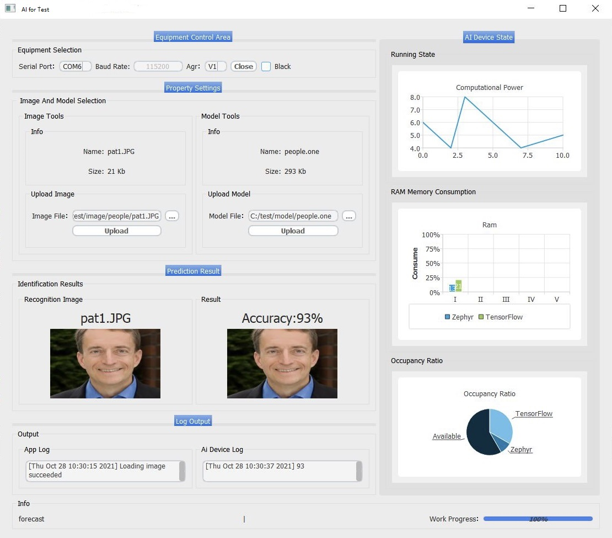
</p>

### Development Language
The upper computer adopts QT C++ for 5.9.

The reason for choosing QT is its development efficiency and portability. A set of code can run well on different platforms

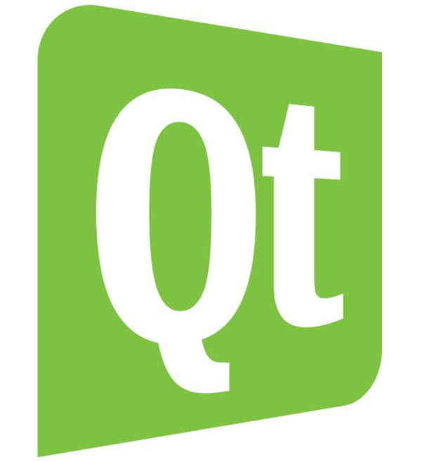5.9

### Support Platform
According to the cross platform characteristics of QT, it can be transplanted between different operating systems

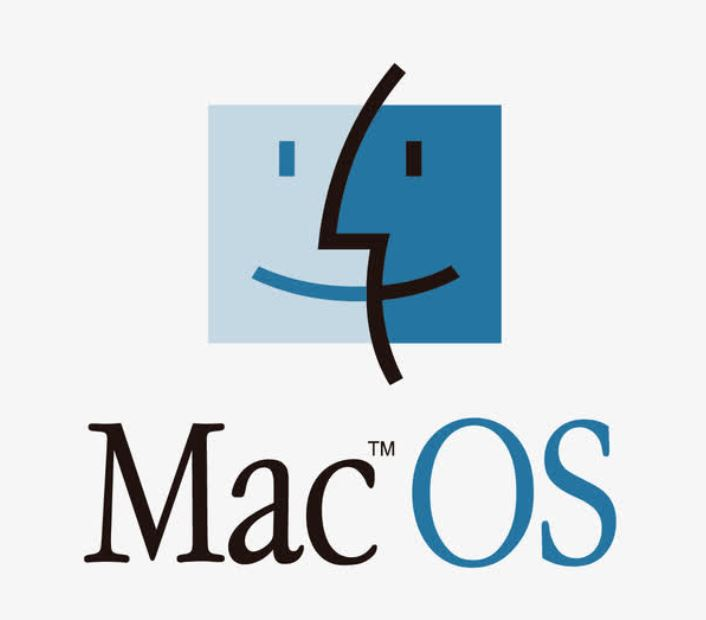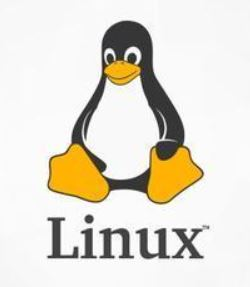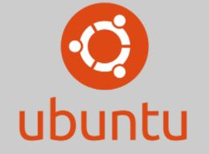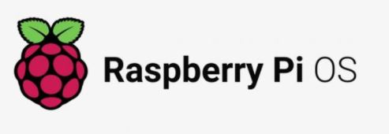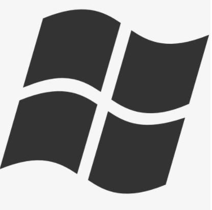

### Characteristic
It can dynamically transmit the model to the lower computer to identify different data, and support the chart function to display some operation data of the lower computer

# Micro-ML Lower machine
## RTOS
The lower computer uses zephyr as the operating system.

Zephyr was chosen because it is a new type of RTOS and a project promoted by Intel. It is supported by the Linux foundation. At the same time, it has developed very well and supports multiple arm framework processors

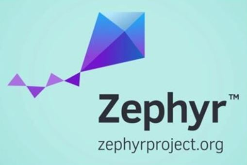

## Artificial Intelligence Library
Porting Intel 1source to low-power micro devices through adaptation and porting it to zephyr.
The AI interface of 1source is well encapsulated at the bottom and several CNN neural algorithms of 1source are transplanted at the same time.

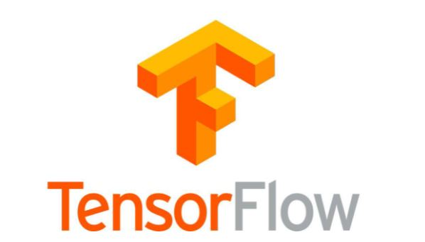

## AI model training library

A complete model training framework is provided for different devices, such as arm-h series and M series.

Users can adapt different hardware platforms based on this framework. Users can adjust the depth and size of the algorithm core according to the application scenario, and improve the efficiency of the algorithm at the same time

For example, optimized model frameworks are provided for image, speech and motion analysis. These model training frameworks are written based on Intel 1source.

## Platform
At present, we have tested the following platforms and can run well

* 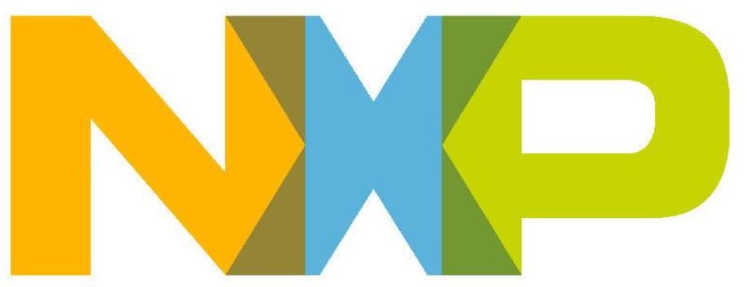
* 
* OSE(Intel - ISH)

## Characteristic

The program of the lower computer can communicate well with the upper computer. Both sides use serial port for communication, and support dynamic replacement model. The upper computer sends model files to the lower computer, and the lower computer automatically replaces the model and re establishes the operator framework.

The lower computer program has very low requirements for hardware. It only needs arm-m Series MCU, and RAM can run within 700kb.

The model prediction results will be fed back to the upper computer through the serial port, and the operation status of some lower computers will be fed back for the upper computer to monitor.

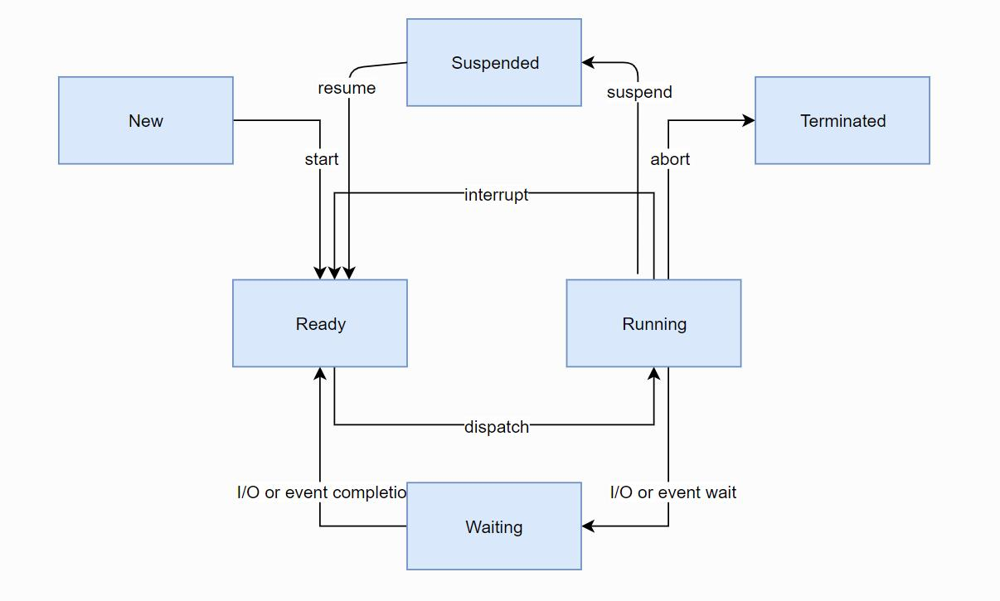

# Contributor

For anyone who makes any sharing for this project, we will put him on this list and thank them for everything they have done for this project. Thank you all
|  Name             | Event | Mailbox  |
|  ----            | ----   | ----    |
| Zhou, Zhihao       | Write AI module And Upper computer program , Creator of the project | [Zhihao.Zhou](mailto:2727056321@qq.com) |

# Feedback
At present, there is only one developer in the project. You can contact the creator directly: [Zhihao.Zhou](mailto:2727056321@qq.com)

# License

Copyright (c) Zhihao.Zhou Corporation. All rights reserved.

Created by [Zhihao.Zhou]
