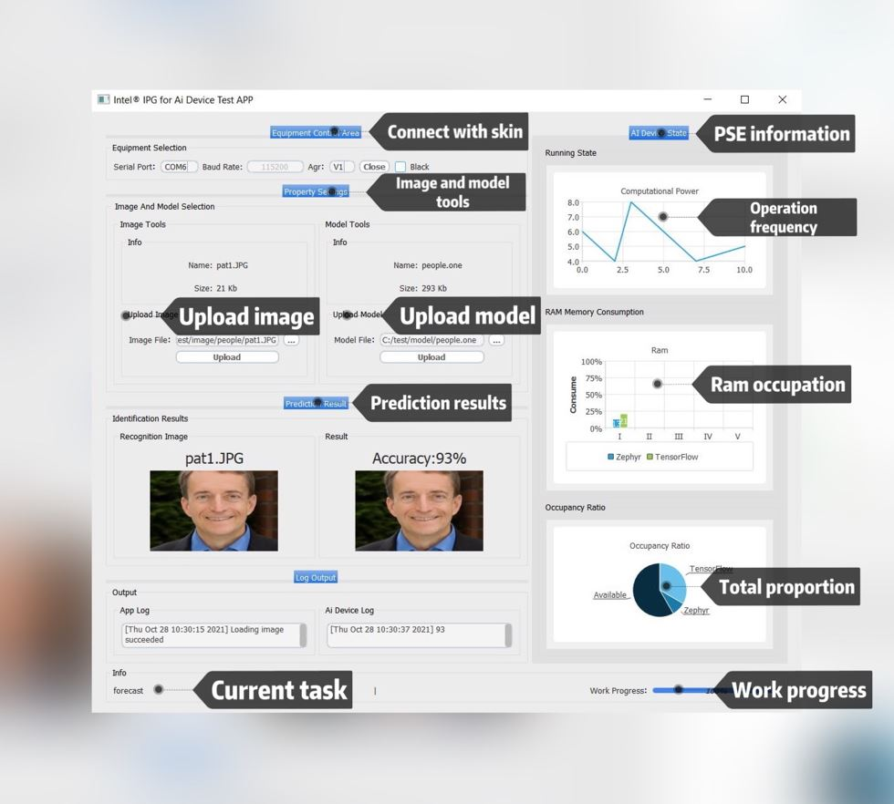

# Project Introduction
This is AI computer program of the project, under the support and interactivity, comes with consistent with lower machine communication protocol, the communication protocol version V1, in order to be able to better interact with the machine and display for some of the state, so the development of the program, this program is written by QT5.9, good cross-platform features, building is also very simple, It compiles well with any QT IDE!

# Function introduction

<p align="center">
  
</p>

# Directory introduction

```
├── ags.h
├── bin
│   └── README.md
├── main.cpp
├── mainwindow.cpp
├── mainwindow.h
├── mainwindow.ui
├── README.md
├── skin
│   ├── black.qss
│   └── white.qss
├── upper_computer.pro
├── waiting.cpp
├── waiting.h
└── waiting.ui

2 directories, 13 files
```

|  Name   | Effect  |
|  ----  | ----  |
| bin  | Plug in directory |
| skin  | Skin directory |

# Introduction to main documents

|  Name   | Effect  |
|  ----  | ----  |
| ags.h  | Communication protocol |
| main.cpp  | Start file |
| mainwindow.cpp  | Window service |
| mainwindow.ui | UI file |
| upper_computer.pro | Qt build file |
| waiting.cpp | waiting windows |
| waiting.ui | waiting windows ui file |
| black.qss | black style file |
| white.qss | white style file |

# Build tutorial
## 1. Build
You can open upper directly on QT ide The computer.pro file, and then start building

You can also use qmake to compile
```bash
qmake upper_computer.pro 
make
```

## 2. Config FFmpeg
You need to download the plug-in from the ffmpeg official website：[ffmpeg](https://github.com/BtbN/FFmpeg-Builds/releases)

Then create a new Bin in the running directory of the program (the generated executable directory)
```
mkdir bin temp
```
Then put the ffmpeg toolkit executable into the bin directory
Finally, you can run the program normally
